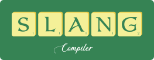

<p align="center">
  
</p>

Slang is a (far from feature-complete) scheme to llvm ir compiler.

## Building

To build everything and run all tests, run the following:
``` bash
meson build
./build_all.sh
```

You need to have the chicken scheme compiler installed to bootstrap slang.

## Examples

To run an example (or your own code), simply use this command:
``` bash
./test_slang.sh examples/romans.scm ./build/self_hosted.elf example
```

# Featuers

* [x] Basic primitive such as pair, list, string, char, vector etc.
* [x] Basic constructs such as `let`, `let*`, `cond`, `if`, `set!`, `begin` etc. (`letrec` and `set-car!`/`set-cdr!` are still missing)
* [x] Some of the primitive functions, most importantly `display` and `equal?` and things like that
* [x] Basic I/O primitives (at the moment only reading files is possible and only `read-char` and `eof-object?` are supported)
* [ ] Tail recursion to loop conversion
* [ ] Continuations with `call/cc`
* [ ] Foreign calls
* [ ] Garbage collection
* [ ] Dynamic heap allocation
